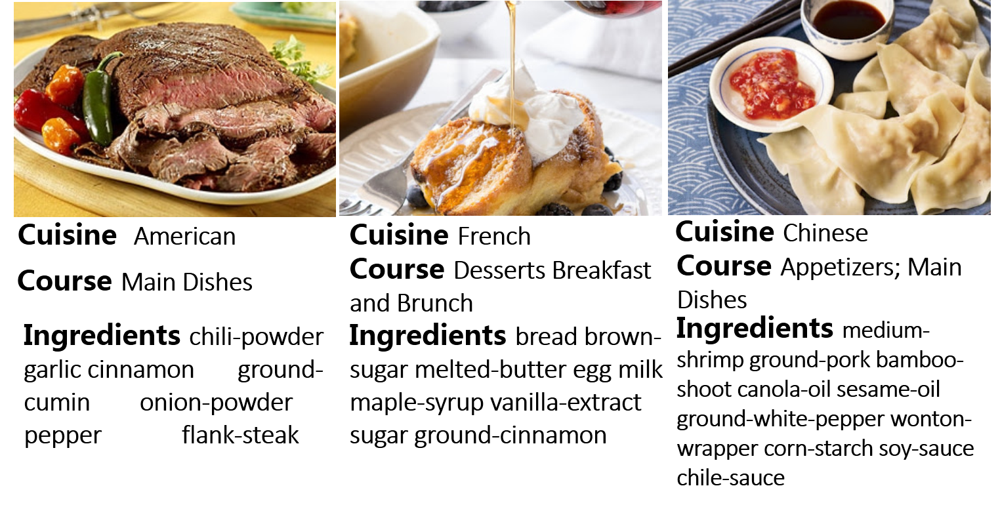

#  
 You Are What You Eat Exploring Rich Recipe Information for Cross Region Food Analysis

 

## Data collection
This dataset consists of 66,615 recipe items from Yummly, namely Yummly_66K. Each recipe item includes the recipe name, preprocessed ingredient line, recipe image, cuisine and course attribute information, and so on. There are totally 10 kinds of cuisines, 14 kinds of courses and 2,416 ingredients in our dataset.

## Data statistics
| Cuisine       | #items        | Cuisine      | #items        | 
| ------------- |:-------------:| -------------|:-------------:|
| American      |   13,262      | Italian      |   9,401       |
| Greek         |   4,998       | Japanese     |   4,804       |
| Mexican       |   7,960       | Indian       |   5,470       |
| Rrench        |   6,173       | Spanish      |   4,014       |
| Thai          |   5,282       | Chinese      |   5,251       |

## The image dataset can be downloaded from the following link:
http://isia.ict.ac.cn/dataset/Yummly-66K.html

## The dataset can also be downloaded from the following links:
Baidu Drive: https://pan.baidu.com/s/139yTIeWZRY-fe9Y6o4vljg \
Google Drive:

